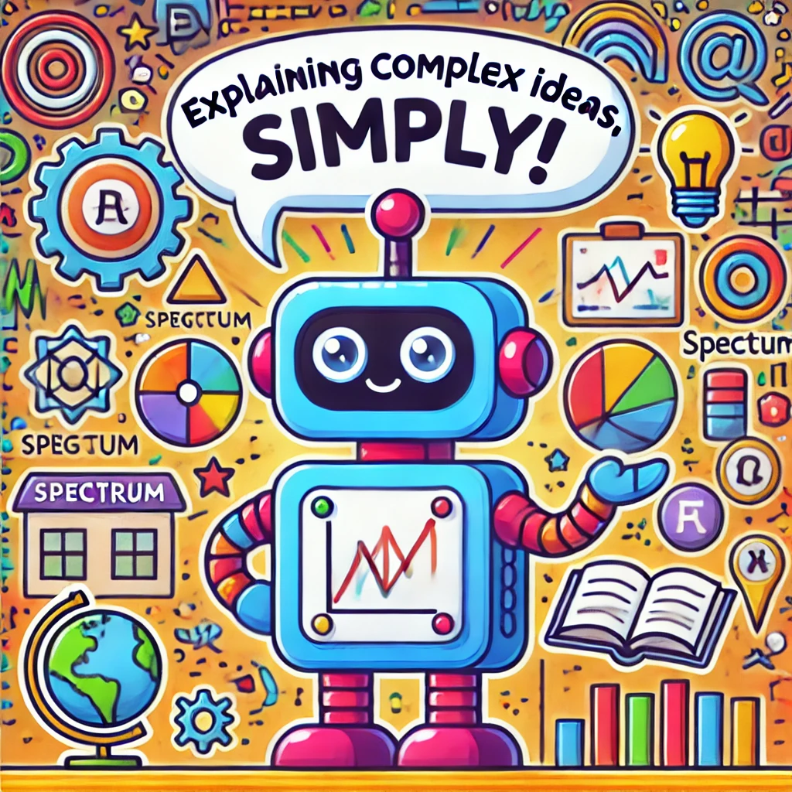

# Kid-Friendly Explainer Tool




This project is a fine-tuned model that generates simplified, kid-friendly explanations of complex concepts, ideal for science, math, wireless communications, physics, and other STEM fields. Using a base language model, we train it to transform technical explanations into language that children (around 7-10 years old) can understand.

## Project Overview

### Purpose
The purpose of this project is to make complex ideas accessible to young learners. We leverage fine-tuning methods on a language model to produce easy-to-understand explanations for technical topics in a conversational and engaging way. This tool is great for educational content creators, teachers, and parents who want to introduce complex ideas to kids.

### Approach
We fine-tune a language model (e.g., GPT-2) on a dataset of simplified explanations using advanced techniques such as:
- **Custom Dataset Loading**: A specialized dataset class `KidFriendlyExplainerDataset` loads data with a structure that includes both the concept to be explained and its kid-friendly version.
- **Training with Reinforcement Techniques**: Various training parameters help adjust the model's temperature, sampling, and token distribution to generate more natural language suited for children.
- **Instruction Tuning**: Tailored prompts ensure the model responds to instructions to generate simplified, kid-friendly explanations.

## Setup and Installation

### Prerequisites
- Python 3.7 or higher
- PyTorch (for model training and fine-tuning)
- `transformers` library by Hugging Face
- `torch` for dataset handling

### Installation

1. Clone this repository:
    ```bash
    git clone https://github.com/your-username/kid-friendly-explainer.git
    cd kid-friendly-explainer
    ```

2. Install the required packages:
    ```bash
    pip install torch transformers
    ```

3. Download a base model to start with (e.g., `gpt2`):
    ```python
    from transformers import AutoTokenizer, AutoModelForCausalLM
    tokenizer = AutoTokenizer.from_pretrained("gpt2")
    model = AutoModelForCausalLM.from_pretrained("gpt2")
    ```

### Preparing Your Dataset

Ensure your data is in JSON format with each item containing:
- `Concept`: The technical term or idea (e.g., "Signal")
- `Explanation`: A simplified, kid-friendly description of the concept.

Example `kid_explanations.json`:
```json
[
    {"Concept": "Classification", "Explanation": "Classification is sorting things into groups, like putting animals into groups like mammals or birds."}
    {"Concept": "Bandwidth", "Explanation": "Bandwidth is how much data can be sent at once."},
    {"Concept": "Cell-Free Communication", "Explanation": "Cell-free communication uses lots of antennas everywhere, so you always have a good signal."},
]
